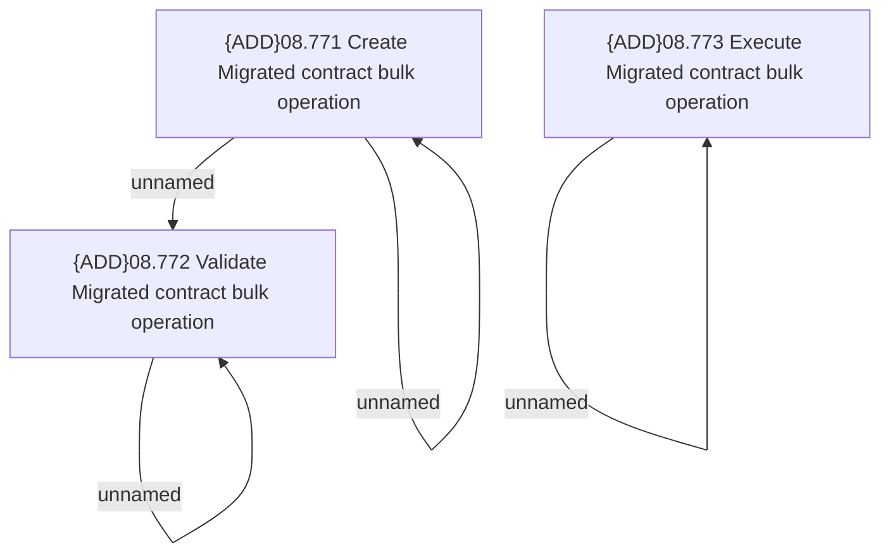

# Access Rights

- **Diagram Type**: Custom
- **Package**: HomerSelect/BSL/Modules/Contract bulk operations (BSA)/Analytical Model/{ADD}Migrated contract/Access Rights
- **Diagram ID**: 164691
- **Elements**: 6
- **Connectors**: 4

