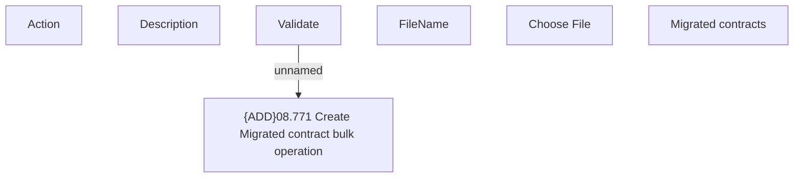

# User Interface Model

- **Diagram Type**: Custom
- **Package**: HomerSelect/BSL/Modules/Contract bulk operations (BSA)/Analytical Model/{ADD}Migrated contract/User Interface Model
- **Diagram ID**: 164693
- **Elements**: 8
- **Connectors**: 1

