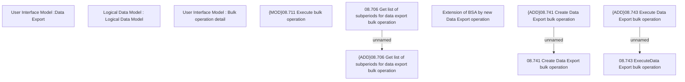

# CBL-15121 (CSI-1682) Data Export

```mermaid
graph TD
    ADD_08_706_Get_list_of_subperiods_for_data_export_bulk_opera["{ADD}08.706 Get list of subperiods for data export bulk operation"]
    User_Interface_Model_Data_Export["User Interface Model :Data Export"]
    Logical_Data_Model_Logical_Data_Model["Logical Data Model : Logical Data Model"]
    User_Interface_Model_Bulk_operation_detail["User Interface Model : Bulk operation detail"]
    MOD_08_711_Execute_bulk_operation["{MOD}08.711 Execute bulk operation"]
    n_08_706_Get_list_of_subperiods_for_data_export_bulk_operati["08.706 Get list of subperiods for data export bulk operation"]
    Extension_of_BSA_by_new_Data_Export_operation["Extension of BSA by new Data Export operation "]
    ADD_08_741_Create_Data_Export_bulk_operation["{ADD}08.741 Create Data Export bulk operation"]
    n_08_741_Create_Data_Export_bulk_operation["08.741 Create Data Export bulk operation"]
    n_08_743_ExecuteData_Export_bulk_operation["08.743 ExecuteData Export bulk operation"]
    ADD_08_743_Execute_Data_Export_bulk_operation["{ADD}08.743 Execute Data Export bulk operation"]
    n_08_706_Get_list_of_subperiods_for_data_export_bulk_operati -->|unnamed| ADD_08_706_Get_list_of_subperiods_for_data_export_bulk_opera
    ADD_08_743_Execute_Data_Export_bulk_operation -->|unnamed| n_08_743_ExecuteData_Export_bulk_operation
    ADD_08_741_Create_Data_Export_bulk_operation -->|unnamed| n_08_741_Create_Data_Export_bulk_operation
```
