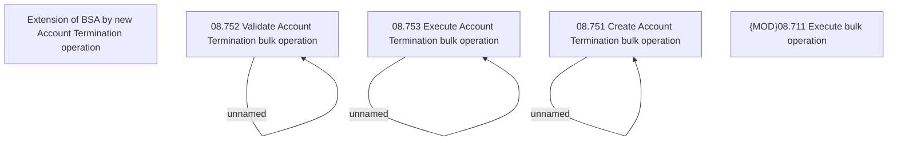

# CBL-22978 (CSI-3314) Account termination

- **Diagram Type**: Custom
- **Package**: HomerSelect/BSL/Modules/Contract bulk operations (BSA)/Requirement model/CBL-22978 (CSI-3314) Account termination
- **Diagram ID**: 157723
- **Elements**: 8
- **Connectors**: 3

