# CBL-26584 (CSI-3772) Usage of COS for Loyalty service Add and Replace

- **Diagram Type**: Custom
- **Package**: HomerSelect/BSL/Modules/Contract bulk operations (BSA)/Requirement model/CBL-26584 (CSI-3772) Usage of COS for Loyalty service add and replace
- **Diagram ID**: 162569
- **Elements**: 7
- **Connectors**: 0

```mermaid
graph TD
    REQ_1_Add_service_and_Replace_service_operations_will_be_upd["REQ #1 -  Add service and Replace service operations will be updated to use COS"]
    n_08_733_Execute_Replace_service_bulk_operation["08.733 Execute Replace service bulk operation"]
    n_08_731_Create_Replace_service_bulk_operation["08.731 Create Replace service bulk operation"]
    n_08_723_Execute_Add_service_bulk_operation["08.723 Execute Add service bulk operation"]
    n_08_721_Create_Add_service_bulk_operation["08.721 Create Add service bulk operation"]
    Process_ContractServiceNotification["Process ContractServiceNotification"]
    Logical_Data_Model_COMMON_Logical_Data_Model["Logical Data Model : COMMON Logical Data Model"]
```

