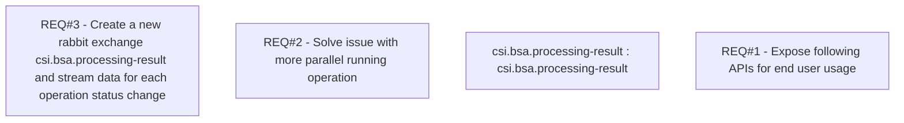

# CBL-28551 (CSI-4100) Expose BSA API and implement Rabbit notification

```mermaid
graph TD
    REQ_3_Create_a_new_rabbit_exchange_csi_bsa_processing_result["REQ#3 - Create a new rabbit exchange csi.bsa.processing-result and stream data for each operation status change"]
    REQ_2_Solve_issue_with_more_parallel_running_operation["REQ#2 - Solve issue with more parallel running operation "]
    csi_bsa_processing_result_csi_bsa_processing_result["csi.bsa.processing-result : csi.bsa.processing-result"]
    REQ_1_Expose_following_APIs_for_end_user_usage["REQ#1 - Expose following APIs for end user usage"]
```
