# Debt Purchase support - REQ

- **Diagram Type**: Custom
- **Package**: HomerSelect/BSL/Modules/Contract bulk operations (BSA)/Requirement model/CBL-30268 (CSI-4570) Debt Purchase support
- **Diagram ID**: 164650
- **Elements**: 10
- **Connectors**: 2

```mermaid
graph TD
    Logical_Data_Model_Logical_Data_Model["Logical Data Model : Logical Data Model"]
    Debt_Purchase_Notification_Debt_Purchase_Notification["Debt Purchase Notification : Debt Purchase Notification"]
    DebtPurchase_Request_notification_DebtPurchase_Request_notif["DebtPurchase Request notification : DebtPurchase Request notification"]
    ADD_Process_DebtPurchaseNotification["{ADD}Process DebtPurchaseNotification"]
    ADD_08_763_Execute_Debt_purchase_bulk_operation["{ADD}08.763 Execute Debt purchase bulk operation"]
    ADD_08_761_Create_Debt_purchase_bulk_operation["{ADD}08.761 Create Debt purchase bulk operation"]
    ADD_08_763_Execute_Debt_purchase_bulk_operation["{ADD}08.763 Execute Debt purchase bulk operation"]
    ADD_08_761_Create_Debt_purchase_bulk_operation["{ADD}08.761 Create Debt purchase bulk operation"]
    REQ_1_Extension_of_BSA_by_Debt_purchase_operation_PH_only["REQ#1: Extension of BSA by Debt purchase operation  (PH only)"]
    MOD_08_711_Execute_bulk_operation["{MOD}08.711 Execute bulk operation"]
    ADD_08_763_Execute_Debt_purchase_bulk_operation -->|unnamed| ADD_08_763_Execute_Debt_purchase_bulk_operation
    ADD_08_761_Create_Debt_purchase_bulk_operation -->|unnamed| ADD_08_761_Create_Debt_purchase_bulk_operation
```

