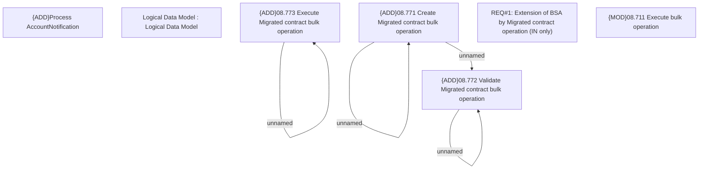

# CBL-31177 (CSI-4598) Migrated contract support

```mermaid
graph TD
    ADD_Process_AccountNotification["{ADD}Process AccountNotification"]
    Logical_Data_Model_Logical_Data_Model["Logical Data Model : Logical Data Model"]
    ADD_08_773_Execute_Migrated_contract_bulk_operation["{ADD}08.773 Execute Migrated contract bulk operation"]
    ADD_08_772_Validate_Migrated_contract_bulk_operation["{ADD}08.772 Validate Migrated contract bulk operation"]
    ADD_08_771_Create_Migrated_contract_bulk_operation["{ADD}08.771 Create Migrated contract bulk operation"]
    ADD_08_773_Execute_Migrated_contract_bulk_operation["{ADD}08.773 Execute Migrated contract bulk operation"]
    ADD_08_772_Validate_Migrated_contract_bulk_operation["{ADD}08.772 Validate Migrated contract bulk operation"]
    ADD_08_771_Create_Migrated_contract_bulk_operation["{ADD}08.771 Create Migrated contract bulk operation"]
    REQ_1_Extension_of_BSA_by_Migrated_contract_operation_IN_onl["REQ#1: Extension of BSA by Migrated contract operation (IN only)"]
    MOD_08_711_Execute_bulk_operation["{MOD}08.711 Execute bulk operation"]
    ADD_08_771_Create_Migrated_contract_bulk_operation -->|unnamed| ADD_08_772_Validate_Migrated_contract_bulk_operation
    ADD_08_773_Execute_Migrated_contract_bulk_operation -->|unnamed| ADD_08_773_Execute_Migrated_contract_bulk_operation
    ADD_08_771_Create_Migrated_contract_bulk_operation -->|unnamed| ADD_08_771_Create_Migrated_contract_bulk_operation
    ADD_08_772_Validate_Migrated_contract_bulk_operation -->|unnamed| ADD_08_772_Validate_Migrated_contract_bulk_operation
```
