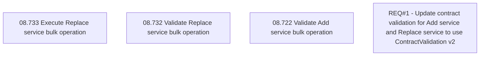

# CSI-1330 - Contract validation v2

- **Diagram Type**: Custom
- **Package**: HomerSelect/BSL/Modules/Contract bulk operations (BSA)/Requirement model/CSI-1330 - Contract validation v2
- **Diagram ID**: 141023
- **Elements**: 4
- **Connectors**: 0

