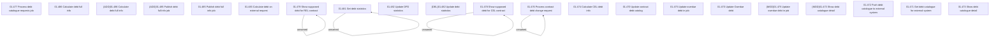

# Access Rights

```mermaid
graph TD
    n_01_477_Process_debt_catalogue_requests_job["01.477 Process debt catalogue requests job"]
    n_01_477_Process_debt_catalogue_requests_job["01.477 Process debt catalogue requests job"]
    n_01_486_Calculate_debt_full_info["01.486 Calculate debt full info"]
    ADD_01_486_Calculate_debt_full_info["{ADD}01.486 Calculate debt full info"]
    ADD_01_485_Publish_debt_full_info_job["{ADD}01.485 Publish debt full info job"]
    n_01_485_Publish_debt_full_info_job["01.485 Publish debt full info job"]
    n_01_483_Calculate_debt_on_external_request["01.483 Calculate debt on external request"]
    n_01_483_Calculate_debt_on_external_request["01.483 Calculate debt on external request"]
    n_01_479_Show_supposed_debt_for_REL_contract["01.479 Show supposed debt for REL contract"]
    n_01_479_Show_supposed_debt_for_REL_contract["01.479 Show supposed debt for REL contract"]
    n_01_481_Get_debt_statistics["01.481 Get debt statistics"]
    n_01_482_Update_DPD_statistics["01.482 Update DPD statistics"]
    DEL_01_482_Update_debt_statistics["{DEL}01.482 Update debt statistics"]
    n_01_481_Get_debt_statistics["01.481 Get debt statistics"]
    n_01_478_Show_supposed_debt_for_CEL_contract["01.478 Show supposed debt for CEL contract"]
    n_01_478_Show_supposed_debt_for_CEL_contract["01.478 Show supposed debt for CEL contract"]
    n_01_476_Process_contract_debt_change_request["01.476 Process contract debt change request"]
    n_01_474_Calculate_CEL_debt_info["01.474 Calculate CEL debt info"]
    n_01_476_Process_contract_debt_change_request["01.476 Process contract debt change request"]
    n_01_470_Update_contract_debt_catalog["01.470 Update contract debt catalog"]
    n_01_475_Update_overdue_debt_in_job["01.475 Update overdue debt in job"]
    n_01_470_Update_Overdue_debt["01.470 Update Overdue debt"]
    MOD_01_475_Update_overdue_debt_in_job["{MOD}01.475 Update overdue debt in job"]
    n_01_474_Calculate_CEL_debt_info["01.474 Calculate CEL debt info"]
    MOD_01_473_Show_debt_catalogue_detail["{MOD}01.473 Show debt catalogue detail"]
    n_01_472_Push_debt_catalogue_to_external_system["01.472 Push debt catalogue to external system"]
    n_01_471_Get_debt_catalogue_for_external_system["01.471 Get debt catalogue for external system"]
    n_01_473_Show_debt_catalogue_detail["01.473 Show debt catalogue detail"]
    n_01_472_Push_debt_catalogue_to_external_system["01.472 Push debt catalogue to external system"]
    n_01_471_Get_debt_catalogue_for_external_system["01.471 Get debt catalogue for external system"]
    n_01_476_Process_contract_debt_change_request -->|unnamed| n_01_476_Process_contract_debt_change_request
    n_01_478_Show_supposed_debt_for_CEL_contract -->|unnamed| n_01_478_Show_supposed_debt_for_CEL_contract
    n_01_481_Get_debt_statistics -->|unnamed| n_01_481_Get_debt_statistics
    n_01_479_Show_supposed_debt_for_REL_contract -->|unnamed| n_01_479_Show_supposed_debt_for_REL_contract
```
