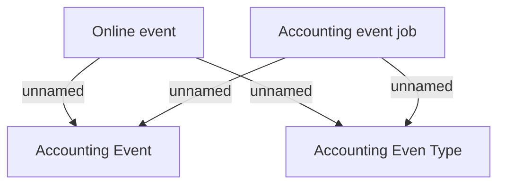

# Accounting Events

- **Diagram Type**: Custom
- **Package**: HomerSelect/BSL/Modules/Debt catalogue/Analytical Model/Business Rules/Accounting Events
- **Diagram ID**: 150475
- **Elements**: 4
- **Connectors**: 4

