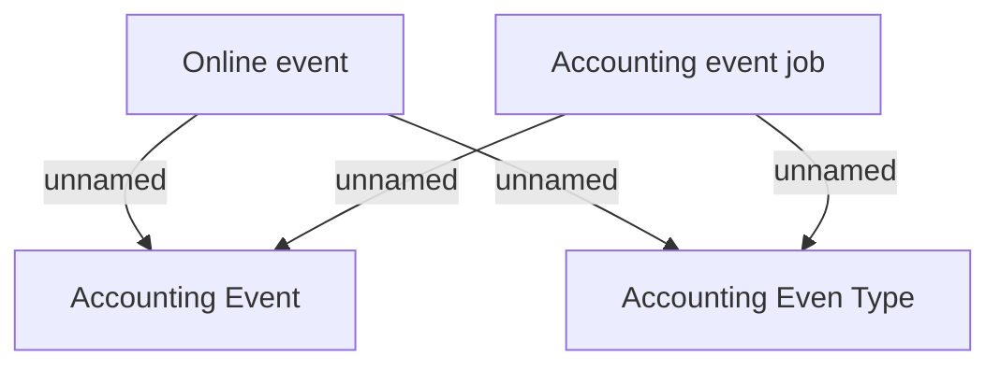

# Accounting Events

```mermaid
graph TD
    Online_event["Online event"]
    Accounting_event_job["Accounting event job"]
    Accounting_Even_Type["Accounting Even Type"]
    Accounting_Event["Accounting Event"]
    Online_event -->|unnamed| Accounting_Event
    Accounting_event_job -->|unnamed| Accounting_Event
    Online_event -->|unnamed| Accounting_Even_Type
    Accounting_event_job -->|unnamed| Accounting_Even_Type
```
