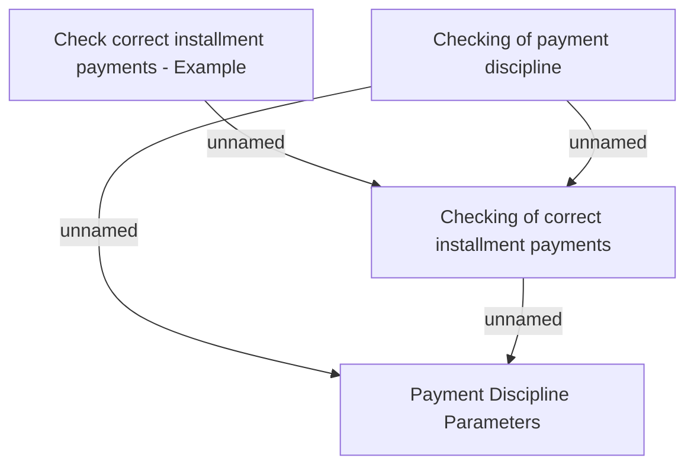

# Payment discipline

- **Diagram Type**: Custom
- **Package**: HomerSelect/BSL/Modules/Debt catalogue/Analytical Model/Business Rules/Checking of Payment Discipline
- **Diagram ID**: 138004
- **Elements**: 4
- **Connectors**: 4

