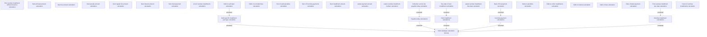

# Debt catalogue calculation formulas hierarchy

```mermaid
graph TD
    First_overdue_installment_without_tolerance_calculation["First overdue installment without tolerance calculation"]
    Next_principal_amount_calculation["Next principal amount calculation"]
    Next_fee_amount_calculation["Next fee amount calculation"]
    Next_penalty_amount_calculation["Next penalty amount calculation"]
    Next_regular_fee_amount_calculation["Next regular fee amount calculation"]
    Next_interest_amount_calculation["Next interest amount calculation"]
    Sum_of_prepayment_calculation["Sum of prepayment calculation"]
    List_of_overdue_installments_calculation["List of overdue installments calculation"]
    Payable_today_calculations["Payable today calculations"]
    Next_installment_calculations["Next installment calculations"]
    Incoming_payment_calculations["Incoming payment calculations"]
    Overdue_installment_calculations["Overdue installment calculations"]
    Collection_service_fee_payable_today_calculation["Collection service fee payable today calculation"]
    Debt_on_excluded_fees_calculation["Debt on excluded fees calculation"]
    Debt_specific_installment_part_type_calculation["Debt specific installment part type calculation"]
    Sum_of_paid_penalties_calculation["Sum of paid penalties calculation"]
    Sum_of_incoming_payments_calculation["Sum of incoming payments calculation"]
    Next_installment_amount_calculation["Next installment amount calculation"]
    Latest_payment_amount_calculation["Latest payment amount calculation"]
    Latest_overdue_installment_number_calculation["Latest overdue installment number calculation"]
    Due_date_of_next_installment_calculation["Due date of next installment calculation"]
    First_overdue_installment_due_date_calculation["First overdue installment due date calculation"]
    Latest_overdue_installment_due_date_calculation["Latest overdue installment due date calculation"]
    Debt_on_principal_calculation["Debt on principal calculation"]
    Debt_on_penalties_calculation["Debt on penalties calculation"]
    Debt_on_other_installments_calculation["Debt on other installments calculation"]
    Debt_on_interest_calculation["Debt on interest calculation"]
    Debt_on_fees_calculation["Debt on fees calculation"]
    Date_of_latest_payment_calculation["Date of latest payment calculation"]
    Date_of_first_payment_calculation["Date of first payment calculation"]
    Count_of_overdue_installments_calculation["Count of overdue installments calculation"]
    Debt_catalogue_calculation_formula["Debt catalogue calculation formula"]
    Due_date_of_next_installment_calculation -->|unnamed| Next_installment_calculations
    Date_of_first_payment_calculation -->|unnamed| Incoming_payment_calculations
    Collection_service_fee_payable_today_calculation -->|unnamed| Payable_today_calculations
    Debt_specific_installment_part_type_calculation -->|unnamed| Debt_catalogue_calculation_formula
    First_overdue_installment_due_date_calculation -->|unnamed| Overdue_installment_calculations
    Debt_on_principal_calculation -->|unnamed| Debt_specific_installment_part_type_calculation
    Payable_today_calculations -->|unnamed| Debt_catalogue_calculation_formula
    Next_installment_calculations -->|unnamed| Debt_catalogue_calculation_formula
    Incoming_payment_calculations -->|unnamed| Debt_catalogue_calculation_formula
    Overdue_installment_calculations -->|unnamed| Debt_catalogue_calculation_formula
```
