# Debt catalogue to calculation formulas

- **Diagram Type**: Custom
- **Package**: HomerSelect/BSL/Modules/Debt catalogue/Analytical Model/Business Rules/Debt Catalogue
- **Diagram ID**: 164269
- **Elements**: 28
- **Connectors**: 32

```mermaid
graph TD
    First_overdue_installment_without_tolerance_calculation["First overdue installment without tolerance calculation"]
    Next_installment_due_date_with_prepayment["Next installment due date with prepayment"]
    Next_installment_amount_with_prepayment["Next installment amount with prepayment"]
    Next_fee_amount_calculation["Next fee amount calculation"]
    Next_penalty_amount_calculation["Next penalty amount calculation"]
    Next_regular_fee_amount_calculation["Next regular fee amount calculation"]
    Next_interest_amount_calculation["Next interest amount calculation"]
    Next_principal_amount_calculation["Next principal amount calculation"]
    Sum_of_prepayment_calculation["Sum of prepayment calculation"]
    Collection_service_fee_payable_today_calculation["Collection service fee payable today calculation"]
    Debt_on_excluded_fees_calculation["Debt on excluded fees calculation"]
    Count_of_overdue_installments_calculation["Count of overdue installments calculation"]
    Sum_of_paid_penalties_calculation["Sum of paid penalties calculation"]
    Sum_of_incoming_payments_calculation["Sum of incoming payments calculation"]
    Next_installment_amount_calculation["Next installment amount calculation"]
    Due_date_of_next_installment_calculation["Due date of next installment calculation"]
    Latest_overdue_installment_due_date_calculation["Latest overdue installment due date calculation"]
    Latest_overdue_installment_number_calculation["Latest overdue installment number calculation"]
    Date_of_first_payment_calculation["Date of first payment calculation"]
    Latest_payment_amount_calculation["Latest payment amount calculation"]
    Date_of_latest_payment_calculation["Date of latest payment calculation"]
    First_overdue_installment_due_date_calculation["First overdue installment due date calculation"]
    Debt_on_other_installments_calculation["Debt on other installments calculation"]
    Debt_on_penalties_calculation["Debt on penalties calculation"]
    Debt_on_fees_calculation["Debt on fees calculation"]
    Debt_on_interest_calculation["Debt on interest calculation"]
    Debt_on_principal_calculation["Debt on principal calculation"]
    Debt_Catalogue["Debt Catalogue"]
    Debt_Catalogue -->|unnamed| Next_principal_amount_calculation
    Debt_Catalogue -->|unnamed| First_overdue_installment_without_tolerance_calculation
    Debt_Catalogue -->|unnamed| Sum_of_incoming_payments_calculation
    Debt_Catalogue -->|unnamed| Sum_of_paid_penalties_calculation
    Debt_Catalogue -->|unnamed| Count_of_overdue_installments_calculation
    Debt_Catalogue -->|unnamed| Debt_on_excluded_fees_calculation
    Debt_Catalogue -->|unnamed| Due_date_of_next_installment_calculation
    Debt_Catalogue -->|unnamed| Sum_of_prepayment_calculation
    Debt_Catalogue -->|unnamed| Latest_overdue_installment_due_date_calculation
    Debt_Catalogue -->|unnamed| Next_interest_amount_calculation
    Debt_Catalogue -->|unnamed| Next_regular_fee_amount_calculation
    Debt_Catalogue -->|unnamed| Next_penalty_amount_calculation
    Debt_Catalogue -->|unnamed| Next_fee_amount_calculation
    Debt_Catalogue -->|unnamed| Next_installment_amount_with_prepayment
    Debt_Catalogue -->|unnamed| Next_installment_due_date_with_prepayment
    Debt_Catalogue -->|unnamed| Collection_service_fee_payable_today_calculation
    Debt_Catalogue -->|unnamed| Debt_on_other_installments_calculation
    Debt_Catalogue -->|unnamed| Debt_on_principal_calculation
    Debt_Catalogue -->|unnamed| Debt_on_interest_calculation
    Debt_Catalogue -->|unnamed| Debt_on_interest_calculation
    Debt_Catalogue -->|unnamed| Debt_on_fees_calculation
    Debt_Catalogue -->|unnamed| Debt_on_fees_calculation
    Debt_Catalogue -->|unnamed| Next_installment_amount_calculation
    Debt_Catalogue -->|unnamed| Debt_on_penalties_calculation
    Debt_Catalogue -->|unnamed| Debt_on_principal_calculation
    Debt_Catalogue -->|unnamed| Debt_on_other_installments_calculation
    Debt_Catalogue -->|unnamed| First_overdue_installment_due_date_calculation
    Debt_Catalogue -->|unnamed| Date_of_latest_payment_calculation
    Debt_Catalogue -->|unnamed| Latest_payment_amount_calculation
    Debt_Catalogue -->|unnamed| Date_of_first_payment_calculation
    Debt_Catalogue -->|unnamed| Latest_overdue_installment_number_calculation
    Debt_Catalogue -->|unnamed| Debt_on_penalties_calculation
```

