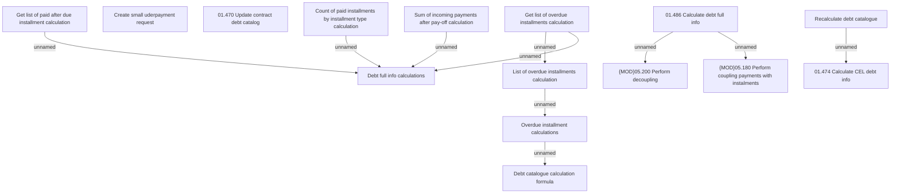

# Debt full info calculations

```mermaid
graph TD
    Recalculate_debt_catalogue["Recalculate debt catalogue"]
    Create_small_uderpayment_request["Create small uderpayment request"]
    n_01_470_Update_contract_debt_catalog["01.470 Update contract debt catalog"]
    Count_of_paid_installments_by_installment_type_calculation["Count of paid installments by installment type calculation"]
    Debt_full_info_calculations["Debt full info calculations"]
    MOD_05_200_Perform_decoupling["{MOD}05.200 Perform decoupling"]
    MOD_05_180_Perform_coupling_payments_with_instalments["{MOD}05.180 Perform coupling payments with instalments"]
    n_01_474_Calculate_CEL_debt_info["01.474 Calculate CEL debt info"]
    Debt_catalogue_calculation_formula["Debt catalogue calculation formula"]
    Overdue_installment_calculations["Overdue installment calculations"]
    List_of_overdue_installments_calculation["List of overdue installments calculation"]
    n_01_486_Calculate_debt_full_info["01.486 Calculate debt full info"]
    Get_list_of_paid_after_due_installment_calculation["Get list of paid after due installment calculation"]
    Sum_of_incoming_payments_after_pay_off_calculation["Sum of incoming payments after pay-off calculation"]
    Get_list_of_overdue_installments_calculation["Get list of overdue installments calculation"]
    Sum_of_incoming_payments_after_pay_off_calculation -->|unnamed| Debt_full_info_calculations
    Count_of_paid_installments_by_installment_type_calculation -->|unnamed| Debt_full_info_calculations
    Get_list_of_overdue_installments_calculation -->|unnamed| Debt_full_info_calculations
    Get_list_of_paid_after_due_installment_calculation -->|unnamed| Debt_full_info_calculations
    Get_list_of_overdue_installments_calculation -->|unnamed| List_of_overdue_installments_calculation
    Recalculate_debt_catalogue -->|unnamed| n_01_474_Calculate_CEL_debt_info
    Overdue_installment_calculations -->|unnamed| Debt_catalogue_calculation_formula
    List_of_overdue_installments_calculation -->|unnamed| Overdue_installment_calculations
    n_01_486_Calculate_debt_full_info -->|unnamed| MOD_05_180_Perform_coupling_payments_with_instalments
    n_01_486_Calculate_debt_full_info -->|unnamed| MOD_05_200_Perform_decoupling
```
