# Debt Securitization

- **Diagram Type**: Custom
- **Package**: HomerSelect/BSL/Modules/Debt catalogue/Analytical Model/Business Rules/Debt Securitization
- **Diagram ID**: 138003
- **Elements**: 12
- **Connectors**: 2

```mermaid
graph TD
    MOD_Calculate_accrued_standard_fees_from_next_installment["{MOD}Calculate accrued standard fees from next installment"]
    MOD_Calculate_sum_of_paid_fees_before_sales_date["{MOD}Calculate sum of paid fees before sales date"]
    SecuritizedPenaltyItem["SecuritizedPenaltyItem"]
    Calculate_debt_on_all_penalties["Calculate debt on all penalties"]
    Debt_on_principal_calculation["Debt on principal calculation"]
    ADD_SecuritizedFeeItem["{ADD}SecuritizedFeeItem"]
    ContractSecuritization["ContractSecuritization"]
    Debt_on_principal_calculation_to_defined_date["Debt on principal calculation to defined date"]
    MOD_Calculate_sum_prescribed_installment_parts_before_passed["{MOD}Calculate sum prescribed installment parts before passed date"]
    Calculate_sum_all_installment_parts_paid_before_passed_date["Calculate sum all installment parts paid before passed date"]
    Calculate_accrued_interest_till_end_of_month["Calculate accrued interest till end of month"]
    MOD_Calculate_accrued_interest_from_next_installment["{MOD}Calculate accrued interest from next installment"]
    ADD_SecuritizedFeeItem -->|unnamed| ContractSecuritization
    SecuritizedPenaltyItem -->|unnamed| ContractSecuritization
```

