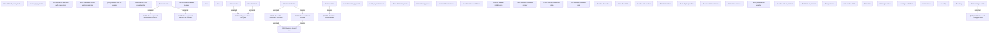

# Debt catalogue detail

```mermaid
graph TD
    Total_debt_with_prepayments["Total debt with prepayments"]
    Sum_of_prepayments["Sum of prepayments"]
    Next_installment_due_date_with_prepayment["Next installment due date with prepayment"]
    Next_installment_amount_with_prepayments["Next installment amount with prepayments"]
    ADD_Overdue_debt_on_penalties["{ADD}Overdue debt on penalties"]
    Total_collection_fees_payable_today["Total collection fees payable today"]
    n_01_479_Show_supposed_debt_for_REL_contract["01.479 Show supposed debt for REL contract"]
    MOD_Business_type_of_loan["{MOD}Business type of loan"]
    n_03_021_Show_REL_installment_schedule["03.021 Show REL installment schedule"]
    n_01_478_Show_supposed_debt_for_CEL_contract["01.478 Show supposed debt for CEL contract"]
    Debt_calculator["Debt calculator"]
    First_overdue_installment_number["First overdue installment number"]
    Next["Next"]
    Prev["Prev"]
    Debt_catalogue_must_be_from_past["Debt catalogue must be from past"]
    MOD_01_210_Show_contract_detail["{MOD}01.210 Show contract detail"]
    MOD_01_473_Show_debt_catalogue_detail["{MOD}01.473 Show debt catalogue detail"]
    n_03_020_Show_installment_schedule["03.020 Show installment schedule"]
    Installment_schedule["Installment schedule"]
    Contract_detail["Contract detail"]
    Show_historical["Show historical"]
    Historical_date["Historical date"]
    Sum_of_incoming_payments["Sum of incoming payments"]
    Latest_payment_amount["Latest payment amount"]
    Date_of_latest_payment["Date of latest payment"]
    Date_of_first_payment["Date of first payment"]
    Next_installment_amount["Next installment amount"]
    Due_date_of_next_installment["Due date of next installment"]
    Count_of_overdue_installments["Count of overdue installments"]
    Latest_overdue_installment_number["Latest overdue installment number"]
    Latest_overdue_installment_date["Latest overdue installment date"]
    First_overdue_installment_date["First overdue installment date"]
    Overdue_other_debt["Overdue other debt"]
    Total_other_debt["Total other debt"]
    Overdue_debt_on_fees["Overdue debt on fees"]
    Total_debt_on_fees["Total debt on fees"]
    Sum_of_paid_penalties["Sum of paid penalties"]
    Overdue_debt_on_interest["Overdue debt on interest"]
    Total_debt_on_interest["Total debt on interest"]
    MOD_Total_debt_on_penalties["{MOD}Total debt on penalties"]
    Overdue_debt_on_principal["Overdue debt on principal"]
    Total_debt_on_principal["Total debt on principal"]
    Days_past_due["Days past due"]
    Total_overdue_debt["Total overdue debt"]
    Total_debt["Total debt"]
    Catalogue_valid_to["Catalogue valid to"]
    Catalogue_valid_from["Catalogue valid from"]
    Contract_code["Contract code"]
    el_1688905["Boundary"]
    el_1688914["Boundary"]
    Debt_catalogue_detail["Debt catalogue detail"]
    Installment_schedule -->|unnamed| n_03_020_Show_installment_schedule
    Debt_catalogue_detail -->|unnamed| MOD_01_473_Show_debt_catalogue_detail
    Contract_detail -->|unnamed| MOD_01_210_Show_contract_detail
    Show_historical -->|unnamed| Debt_catalogue_must_be_from_past
    Historical_date -->|unnamed| Debt_catalogue_must_be_from_past
    Debt_calculator -->|unnamed| n_01_478_Show_supposed_debt_for_CEL_contract
    Installment_schedule -->|unnamed| n_03_021_Show_REL_installment_schedule
    Debt_calculator -->|unnamed| n_01_479_Show_supposed_debt_for_REL_contract
    n_03_020_Show_installment_schedule -->|unnamed| MOD_Business_type_of_loan
    n_03_021_Show_REL_installment_schedule -->|unnamed| MOD_Business_type_of_loan
```
