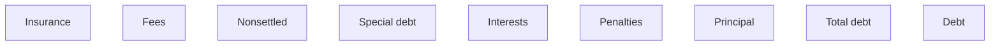

# Debt calculation panel

- **Diagram Type**: Custom
- **Package**: HomerSelect/BSL/Modules/Debt catalogue/Analytical Model/User interface model/Debt calculator
- **Diagram ID**: 138007
- **Elements**: 9
- **Connectors**: 0

