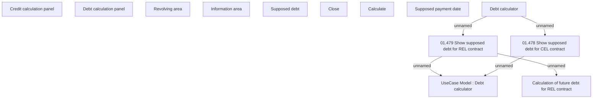

# Debt calculator

- **Diagram Type**: Custom
- **Package**: HomerSelect/BSL/Modules/Debt catalogue/Analytical Model/User interface model/Debt calculator
- **Diagram ID**: 137998
- **Elements**: 13
- **Connectors**: 5

