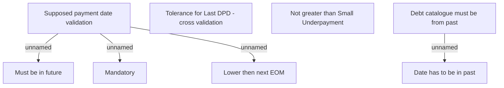

# Validation rules

```mermaid
graph TD
    Lower_then_next_EOM["Lower then next EOM"]
    Mandatory["Mandatory"]
    Must_be_in_future["Must be in future"]
    Supposed_payment_date_validation["Supposed payment date validation"]
    Tolerance_for_Last_DPD_cross_validation["Tolerance for Last DPD - cross validation"]
    Not_greater_than_Small_Underpayment["Not greater than Small Underpayment"]
    Debt_catalogue_must_be_from_past["Debt catalogue must be from past"]
    Date_has_to_be_in_past["Date has to be in past"]
    Debt_catalogue_must_be_from_past -->|unnamed| Date_has_to_be_in_past
    Supposed_payment_date_validation -->|unnamed| Must_be_in_future
    Supposed_payment_date_validation -->|unnamed| Mandatory
    Supposed_payment_date_validation -->|unnamed| Lower_then_next_EOM
```
