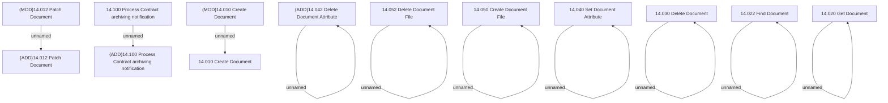

# Access Rights

```mermaid
graph TD
    MOD_14_012_Patch_Document["{MOD}14.012 Patch Document"]
    ADD_14_012_Patch_Document["{ADD}14.012 Patch Document"]
    ADD_14_042_Delete_Document_Attribute["{ADD}14.042 Delete Document Attribute"]
    ADD_14_042_Delete_Document_Attribute["{ADD}14.042 Delete Document Attribute"]
    ADD_14_100_Process_Contract_archiving_notification["{ADD}14.100 Process Contract archiving notification"]
    n_14_100_Process_Contract_archiving_notification["14.100 Process Contract archiving notification"]
    n_14_052_Delete_Document_File["14.052 Delete Document File"]
    n_14_050_Create_Document_File["14.050 Create Document File"]
    n_14_040_Set_Document_Attribute["14.040 Set Document Attribute"]
    n_14_040_Set_Document_Attribute["14.040 Set Document Attribute"]
    n_14_052_Delete_Document_File["14.052 Delete Document File"]
    n_14_050_Create_Document_File["14.050 Create Document File"]
    n_14_030_Delete_Document["14.030 Delete Document"]
    n_14_030_Delete_Document["14.030 Delete Document"]
    n_14_022_Find_Document["14.022 Find Document"]
    n_14_020_Get_Document["14.020 Get Document"]
    MOD_14_010_Create_Document["{MOD}14.010 Create Document"]
    n_14_010_Create_Document["14.010 Create Document"]
    n_14_022_Find_Document["14.022 Find Document"]
    n_14_020_Get_Document["14.020 Get Document"]
    n_14_052_Delete_Document_File -->|unnamed| n_14_052_Delete_Document_File
    n_14_040_Set_Document_Attribute -->|unnamed| n_14_040_Set_Document_Attribute
    ADD_14_042_Delete_Document_Attribute -->|unnamed| ADD_14_042_Delete_Document_Attribute
    n_14_100_Process_Contract_archiving_notification -->|unnamed| ADD_14_100_Process_Contract_archiving_notification
    MOD_14_012_Patch_Document -->|unnamed| ADD_14_012_Patch_Document
    n_14_020_Get_Document -->|unnamed| n_14_020_Get_Document
    n_14_022_Find_Document -->|unnamed| n_14_022_Find_Document
    n_14_030_Delete_Document -->|unnamed| n_14_030_Delete_Document
    MOD_14_010_Create_Document -->|unnamed| n_14_010_Create_Document
    n_14_050_Create_Document_File -->|unnamed| n_14_050_Create_Document_File
```
