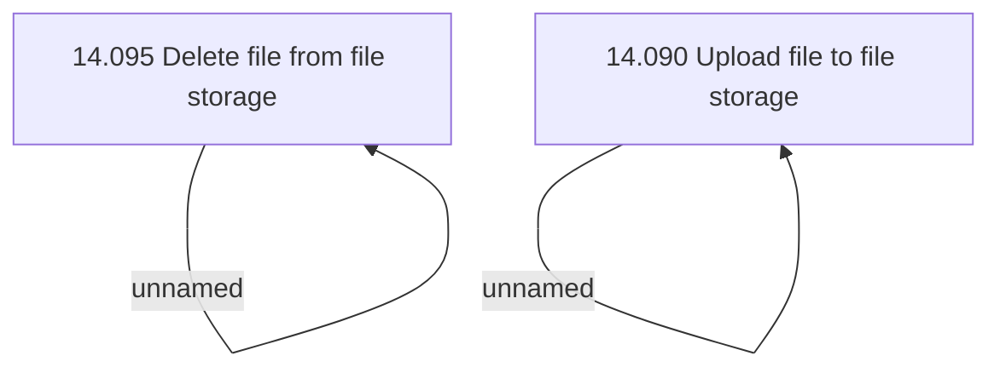

# Access Rights

- **Diagram Type**: Custom
- **Package**: HomerSelect/BSL/Modules/Document management (DMS)/Analytical Model/Document Instances/Integration with file storage/Access Rights
- **Diagram ID**: 135839
- **Elements**: 4
- **Connectors**: 2

