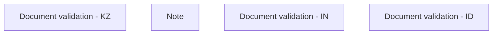

# Validation rules

- **Diagram Type**: Custom
- **Package**: HomerSelect/BSL/Modules/Document management (DMS)/Custom data types definition and validator library/Validation rules
- **Diagram ID**: 139474
- **Elements**: 4
- **Connectors**: 0

