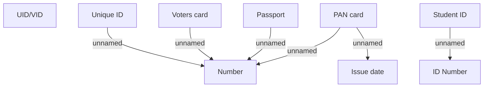

# Document validation - IN

```mermaid
graph TD
    UID_VID["UID/VID"]
    Number["Number"]
    Unique_ID["Unique ID"]
    Voters_card["Voters card"]
    Number["Number"]
    Number["Number"]
    Passport["Passport"]
    ID_Number["ID Number"]
    Issue_date["Issue date"]
    Number["Number"]
    PAN_card["PAN card"]
    Student_ID["Student ID"]
    Student_ID -->|unnamed| ID_Number
    PAN_card -->|unnamed| Number
    PAN_card -->|unnamed| Issue_date
    Passport -->|unnamed| Number
    Voters_card -->|unnamed| Number
    Unique_ID -->|unnamed| Number
```
