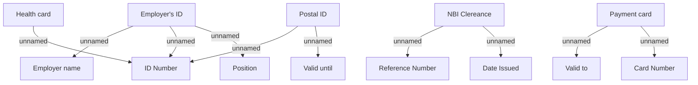

# Generic documents

- **Diagram Type**: Custom
- **Package**: HomerSelect/BSL/Modules/Document management (DMS)/Custom data types definition and validator library/Validation rules/PH/Generic
- **Diagram ID**: 139491
- **Elements**: 15
- **Connectors**: 10

