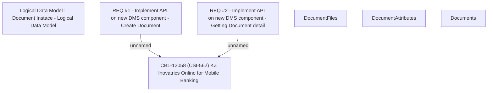

# CBL-12058 (CSI-562) KZ Inovatrics Online for Mobile Banking

```mermaid
graph TD
    Logical_Data_Model_Document_Instace_Logical_Data_Model["Logical Data Model : Document Instace - Logical Data Model"]
    CBL_12058_CSI_562_KZ_Inovatrics_Online_for_Mobile_Banking["CBL-12058 (CSI-562) KZ Inovatrics Online for Mobile Banking"]
    REQ_2_Implement_API_on_new_DMS_component_Getting_Document_de["REQ #2 - Implement API on new DMS component - Getting Document detail"]
    REQ_1_Implement_API_on_new_DMS_component_Create_Document["REQ #1 - Implement API on new DMS component - Create Document"]
    DocumentFiles["DocumentFiles"]
    DocumentAttributes["DocumentAttributes"]
    Documents["Documents"]
    REQ_1_Implement_API_on_new_DMS_component_Create_Document -->|unnamed| CBL_12058_CSI_562_KZ_Inovatrics_Online_for_Mobile_Banking
    REQ_2_Implement_API_on_new_DMS_component_Getting_Document_de -->|unnamed| CBL_12058_CSI_562_KZ_Inovatrics_Online_for_Mobile_Banking
```
