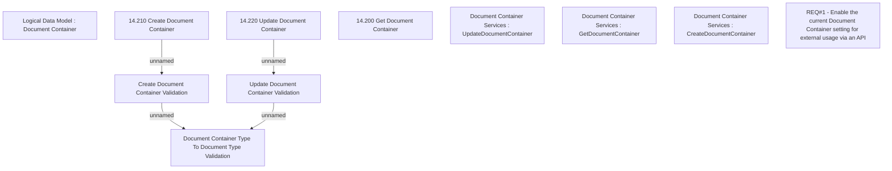

# CBL-13070 (CSI-915) Document Container API

- **Diagram Type**: Custom
- **Package**: HomerSelect/BSL/Modules/Document management (DMS)/Requirement Model/CBL-13070 (CSI-915) Document Container API
- **Diagram ID**: 141848
- **Elements**: 11
- **Connectors**: 4

