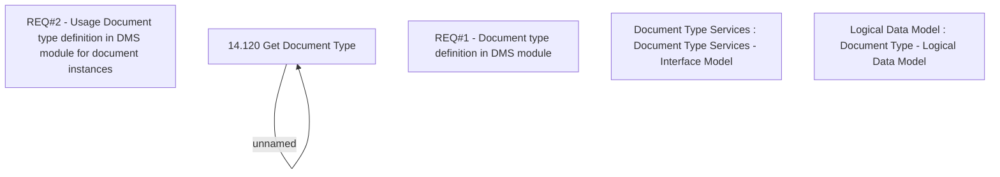

# CBL-13969 (CSI-82) Document Type interface

- **Diagram Type**: Custom
- **Package**: HomerSelect/BSL/Modules/Document management (DMS)/Requirement Model/CBL-13969 (CSI-82) Document Type interface
- **Diagram ID**: 138325
- **Elements**: 6
- **Connectors**: 1

