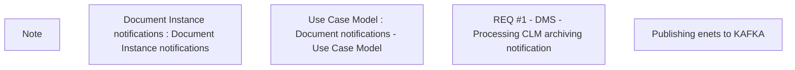

# CBL-14638 (CSI-1225) Cabinet - Contract documents to Central Archive

- **Diagram Type**: Custom
- **Package**: HomerSelect/BSL/Modules/Document management (DMS)/Requirement Model/CBL-14638 (CSI-1225) Cabinet - Contract documents to Central Archive
- **Diagram ID**: 141542
- **Elements**: 5
- **Connectors**: 0

