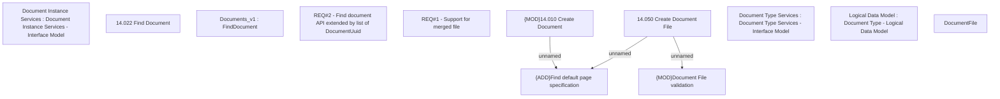

# CBL-14943 (CSI-1040) Support for merged files

```mermaid
graph TD
    Document_Instance_Services_Document_Instance_Services_Interf["Document Instance Services : Document Instance Services - Interface Model"]
    n_14_022_Find_Document["14.022 Find Document"]
    Documents_v1_FindDocument["Documents_v1 : FindDocument"]
    REQ_2_Find_document_API_extended_by_list_of_DocumentUuid["REQ#2 - Find document API extended by list of DocumentUuid"]
    REQ_1_Support_for_merged_file["REQ#1 - Support for merged file"]
    MOD_14_010_Create_Document["{MOD}14.010 Create Document"]
    ADD_Find_default_page_specification["{ADD}Find default page specification"]
    n_14_050_Create_Document_File["14.050 Create Document File"]
    MOD_Document_File_validation["{MOD}Document File validation"]
    Document_Type_Services_Document_Type_Services_Interface_Mode["Document Type Services : Document Type Services - Interface Model"]
    Logical_Data_Model_Document_Type_Logical_Data_Model["Logical Data Model : Document Type - Logical Data Model"]
    DocumentFile["DocumentFile"]
    MOD_14_010_Create_Document -->|unnamed| ADD_Find_default_page_specification
    n_14_050_Create_Document_File -->|unnamed| ADD_Find_default_page_specification
    n_14_050_Create_Document_File -->|unnamed| MOD_Document_File_validation
```
