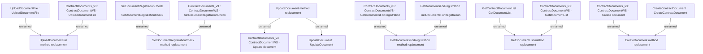

# CBL-16225 (CSI-1363) Replacement ContractDocumentWS methods

```mermaid
graph TD
    UploadDocumentFile_UploadDocumentFile["UploadDocumentFile : UploadDocumentFile"]
    UpdateDocument_UpdateDocument["UpdateDocument : UpdateDocument"]
    SetDocumentRegistrationCheck_SetDocumentRegistrationCheck["SetDocumentRegistrationCheck : SetDocumentRegistrationCheck"]
    ContractDocuments_v3_ContractDocumentWS_UploadDocumentFile["ContractDocuments_v3 : ContractDocumentWS - UploadDocumentFile"]
    ContractDocuments_v3_ContractDocumentWS_Update_document["ContractDocuments_v3 : ContractDocumentWS - Update document"]
    ContractDocuments_v3_ContractDocumentWS_SetDocumentRegistrat["ContractDocuments_v3 : ContractDocumentWS - SetDocumentRegistrationCheck"]
    UploadDocumentFile_method_replacement["UploadDocumentFile method replacement"]
    UpdateDocument_method_replacement["UpdateDocument method replacement"]
    SetDocumentRegistrationCheck_method_replacement["SetDocumentRegistrationCheck method replacement"]
    ContractDocuments_v3_ContractDocumentWS_GetDocumentsForRegis["ContractDocuments_v3 : ContractDocumentWS - GetDocumentsForRegistration"]
    GetDocumentsForRegistration_GetDocumentsForRegistration["GetDocumentsForRegistration : GetDocumentsForRegistration"]
    GetDocumentsForRegistration_method_replacement["GetDocumentsForRegistration method replacement"]
    GetContractDocumentList_GetDocumentList["GetContractDocumentList :GetDocumentList"]
    ContractDocuments_v3_ContractDocumentWS_GetDocumentList["ContractDocuments_v3 : ContractDocumentWS - GetDocumentList"]
    GetDocumentList_method_replacement["GetDocumentList method replacement"]
    ContractDocuments_v3_ContractDocumentWS_Create_document["ContractDocuments_v3 : ContractDocumentWS - Create document"]
    CreateContractDocument_CreateContractDocument["CreateContractDocument : CreateContractDocument"]
    CreateDocument_method_replacement["CreateDocument method replacement"]
    ContractDocuments_v3_ContractDocumentWS_Create_document -->|unnamed| CreateDocument_method_replacement
    CreateContractDocument_CreateContractDocument -->|unnamed| CreateDocument_method_replacement
    GetContractDocumentList_GetDocumentList -->|unnamed| GetDocumentList_method_replacement
    ContractDocuments_v3_ContractDocumentWS_GetDocumentList -->|unnamed| GetDocumentList_method_replacement
    ContractDocuments_v3_ContractDocumentWS_GetDocumentsForRegis -->|unnamed| GetDocumentsForRegistration_method_replacement
    GetDocumentsForRegistration_GetDocumentsForRegistration -->|unnamed| GetDocumentsForRegistration_method_replacement
    SetDocumentRegistrationCheck_SetDocumentRegistrationCheck -->|unnamed| SetDocumentRegistrationCheck_method_replacement
    ContractDocuments_v3_ContractDocumentWS_SetDocumentRegistrat -->|unnamed| SetDocumentRegistrationCheck_method_replacement
    UploadDocumentFile_UploadDocumentFile -->|unnamed| UploadDocumentFile_method_replacement
    ContractDocuments_v3_ContractDocumentWS_UploadDocumentFile -->|unnamed| UploadDocumentFile_method_replacement
    UpdateDocument_method_replacement -->|unnamed| ContractDocuments_v3_ContractDocumentWS_Update_document
    UpdateDocument_method_replacement -->|unnamed| UpdateDocument_UpdateDocument
```
