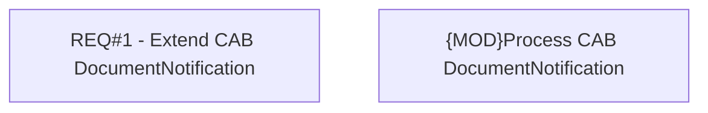

# CBL-30572 (CSI-4306) Receive file expiration from CAB

- **Diagram Type**: Custom
- **Package**: HomerSelect/BSL/Modules/Document management (DMS)/Requirement Model/CBL-30572 (CSI-4306) Receive file expiration from CAB
- **Diagram ID**: 164639
- **Elements**: 2
- **Connectors**: 0

