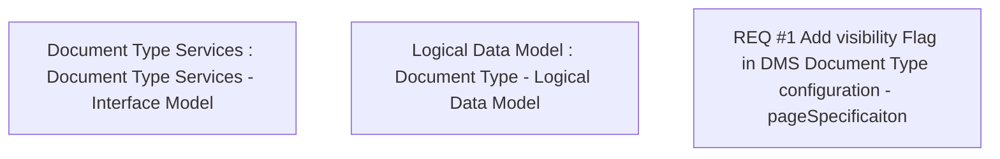

# CBL-30573 (CSI-4586) Hide and Set Optional “Back Page” and “PSA Selfie” Specification Type in BSL

- **Diagram Type**: Custom
- **Package**: HomerSelect/BSL/Modules/Document management (DMS)/Requirement Model/CBL-30573 (CSI-4586) Hide and Set Optional “Back Page” and “PSA Selfie” Specification Type in BSL
- **Diagram ID**: 164640
- **Elements**: 3
- **Connectors**: 0

