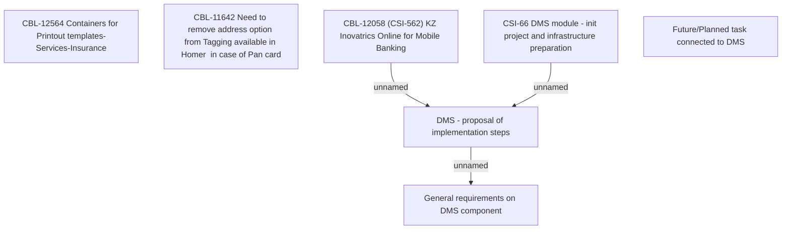

# CBL-8752 Separate document management and expose it via REST API

```mermaid
graph TD
    CBL_12564_Containers_for_Printout_templates_Services_Insuran["CBL-12564 Containers for Printout templates-Services-Insurance"]
    CBL_11642_Need_to_remove_address_option_from_Tagging_availab["CBL-11642 Need to remove address option from Tagging available in Homer  in case of Pan card"]
    CBL_12058_CSI_562_KZ_Inovatrics_Online_for_Mobile_Banking["CBL-12058 (CSI-562) KZ Inovatrics Online for Mobile Banking"]
    CSI_66_DMS_module_init_project_infrastructure_preparation["CSI-66 DMS module - init project and infrastructure preparation"]
    DMS_proposal_of_implementation_steps["DMS - proposal of implementation steps"]
    General_requirements_on_DMS_component["General requirements on DMS component"]
    Future_Planned_task_connected_to_DMS["Future/Planned task connected to DMS"]
    DMS_proposal_of_implementation_steps -->|unnamed| General_requirements_on_DMS_component
    CBL_12058_CSI_562_KZ_Inovatrics_Online_for_Mobile_Banking -->|unnamed| DMS_proposal_of_implementation_steps
    CSI_66_DMS_module_init_project_infrastructure_preparation -->|unnamed| DMS_proposal_of_implementation_steps
```
