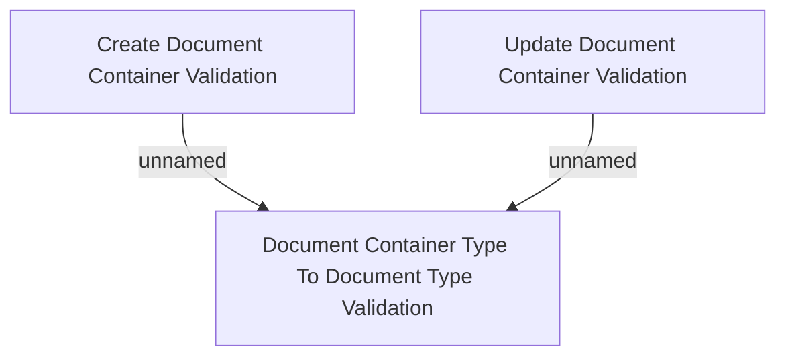

# Business Rules

- **Diagram Type**: Custom
- **Package**: HomerSelect/BSL/Modules/Document management (DMS_NG)/Analytical Model/Document Container/Business Rules
- **Diagram ID**: 162117
- **Elements**: 3
- **Connectors**: 2

