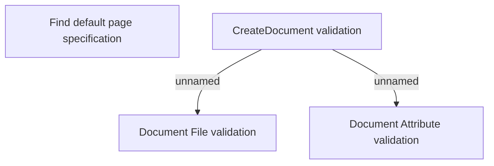

# Business rules

- **Diagram Type**: Custom
- **Package**: HomerSelect/BSL/Modules/Document management (DMS_NG)/Analytical Model/Document Instances/Business rules
- **Diagram ID**: 162120
- **Elements**: 4
- **Connectors**: 2

