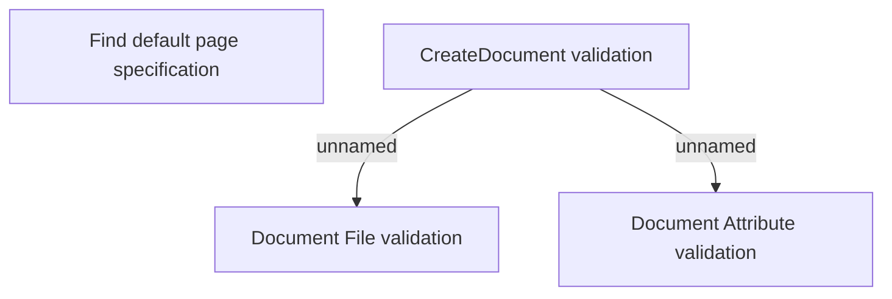

# Business rules

```mermaid
graph TD
    Find_default_page_specification["Find default page specification"]
    CreateDocument_validation["CreateDocument validation"]
    Document_Attribute_validation["Document Attribute validation"]
    Document_File_validation["Document File validation"]
    CreateDocument_validation -->|unnamed| Document_File_validation
    CreateDocument_validation -->|unnamed| Document_Attribute_validation
```
