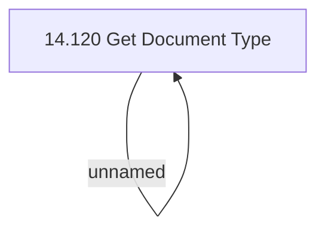

# Access Rights

- **Diagram Type**: Custom
- **Package**: HomerSelect/BSL/Modules/Document management (DMS_NG)/Analytical Model/Document Type Definition/Access Rights
- **Diagram ID**: 162126
- **Elements**: 2
- **Connectors**: 1

