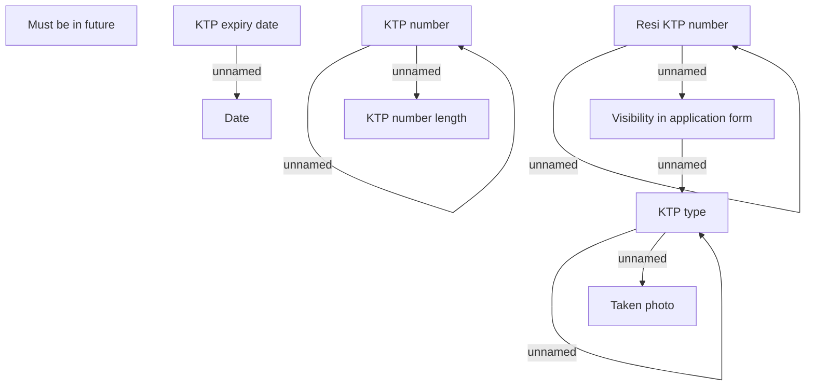

# Document validation - ID

- **Diagram Type**: Custom
- **Package**: HomerSelect/BSL/Modules/Document management (DMS_NG)/Custom data types definition and validator library/Validation rules/ID
- **Diagram ID**: 162096
- **Elements**: 12
- **Connectors**: 8

