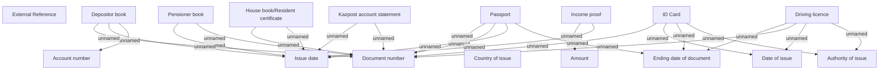

# Document validation - KZ

```mermaid
graph TD
    External_Reference["External Reference"]
    Amount["Amount"]
    House_book_Resident_certificate["House book/Resident certificate"]
    Kazpost_account_statement["Kazpost account statement"]
    Pensioner_book["Pensioner book"]
    Ending_date_of_document["Ending date of document"]
    Date_of_issue["Date of issue"]
    Authority_of_issue["Authority of issue"]
    Driving_licence["Driving licence"]
    Country_of_issue["Country of issue"]
    Passport["Passport"]
    Account_number["Account number"]
    Depositor_book["Depositor book"]
    Document_number["Document number"]
    Issue_date["Issue date"]
    Income_proof["Income proof"]
    Ending_date_of_document["Ending date of document"]
    Authority_of_issue["Authority of issue"]
    Document_number["Document number"]
    Date_of_issue["Date of issue"]
    ID_Card["ID Card"]
    Passport -->|unnamed| Ending_date_of_document
    House_book_Resident_certificate -->|unnamed| Issue_date
    Kazpost_account_statement -->|unnamed| Document_number
    Kazpost_account_statement -->|unnamed| Issue_date
    Pensioner_book -->|unnamed| Document_number
    Pensioner_book -->|unnamed| Issue_date
    Driving_licence -->|unnamed| Authority_of_issue
    Driving_licence -->|unnamed| Date_of_issue
    Driving_licence -->|unnamed| Document_number
    Driving_licence -->|unnamed| Ending_date_of_document
    House_book_Resident_certificate -->|unnamed| Document_number
    Passport -->|unnamed| Issue_date
    ID_Card -->|unnamed| Authority_of_issue
    Passport -->|unnamed| Document_number
    Depositor_book -->|unnamed| Account_number
    Depositor_book -->|unnamed| Issue_date
    Depositor_book -->|unnamed| Document_number
    Income_proof -->|unnamed| Issue_date
    Income_proof -->|unnamed| Amount
    ID_Card -->|unnamed| Ending_date_of_document
    ID_Card -->|unnamed| Date_of_issue
    ID_Card -->|unnamed| Document_number
    Passport -->|unnamed| Country_of_issue
```
