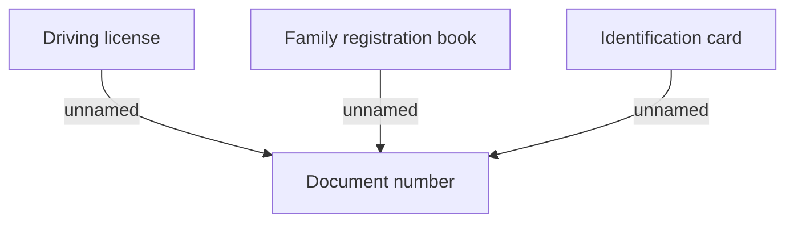

# Document validation - VN

- **Diagram Type**: Custom
- **Package**: HomerSelect/BSL/Modules/Document management (DMS_NG)/Custom data types definition and validator library/Validation rules/VN
- **Diagram ID**: 162102
- **Elements**: 6
- **Connectors**: 3

