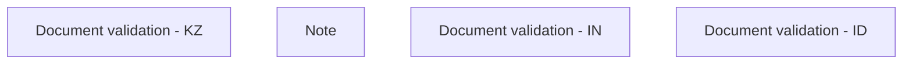

# Validation rules

```mermaid
graph TD
    Document_validation_KZ["Document validation - KZ"]
    el_1856675["Note"]
    Document_validation_IN["Document validation - IN"]
    Document_validation_ID["Document validation - ID"]
```
