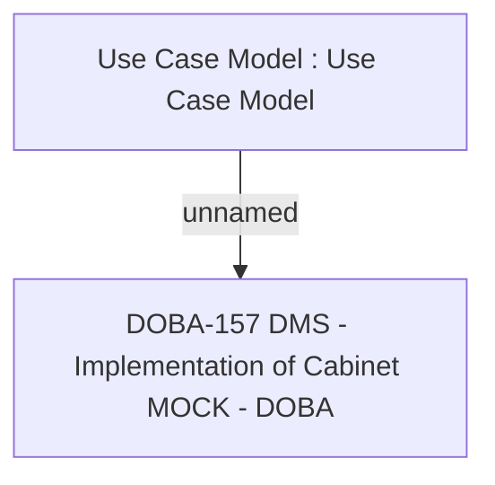

# CBL-28824 Contract management - SIR, SUP, COMA, COS

- **Diagram Type**: Custom
- **Package**: HomerSelect/BSL/Modules/Document management (DMS_NG)/Requirement Model/CBL-28824 Contract management - SIR, SUP, COMA, COS
- **Diagram ID**: 162100
- **Elements**: 2
- **Connectors**: 1

