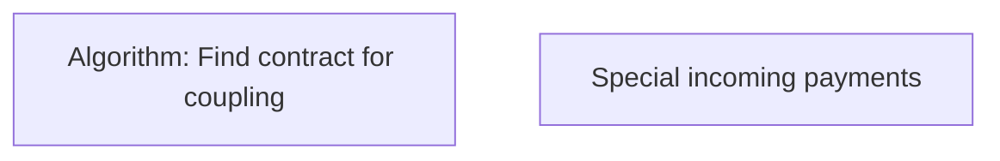

# Business Rules

- **Diagram Type**: Custom
- **Package**: HomerSelect/BSL/Modules/Incoming Payments/Analytical Model/COMMON for Incoming Payments/Business Rules
- **Diagram ID**: 143097
- **Elements**: 2
- **Connectors**: 0

