# Access Rights

- **Diagram Type**: Custom
- **Package**: HomerSelect/BSL/Modules/Incoming Payments/Analytical Model/Import incoming payments/Access Rights
- **Diagram ID**: 143098
- **Elements**: 19
- **Connectors**: 4

```mermaid
graph TD
    n_05_298_Check_incoming_payment_file_for_finish["05.298 Check incoming payment file for finish"]
    n_05_297_Process_results_of_incoming_payment_pairing["05.297 Process results of incoming payment pairing"]
    External_Reference["External Reference"]
    External_Reference["External Reference"]
    n_05_012_Automatic_import_incoming_payments["05.012 Automatic import incoming payments"]
    External_Reference["External Reference"]
    Access_rights_for_imported_files_processing["Access rights for imported files processing"]
    n_05_295_Pair_incoming_payments_from_file["05.295 Pair incoming payments from file"]
    n_05_290_Confirm_incoming_payment_file["05.290 Confirm incoming payment file"]
    n_05_280_Browse_incoming_payment_files["05.280 Browse incoming payment files"]
    External_Reference["External Reference"]
    External_Reference["External Reference"]
    External_Reference["External Reference"]
    n_05_220_Process_incoming_payments_file["05.220 Process incoming payments file"]
    n_05_010_Import_incoming_payments_file["05.010 Import incoming payments file"]
    n_05_220_Process_incoming_payments_file["05.220 Process incoming payments file"]
    External_Reference["External Reference"]
    n_05_292_Remove_incoming_payment_file["05.292 Remove incoming payment file"]
    External_Reference["External Reference"]
    Access_rights_for_imported_files_processing -->|unnamed| n_05_292_Remove_incoming_payment_file
    Access_rights_for_imported_files_processing -->|unnamed| n_05_290_Confirm_incoming_payment_file
    Access_rights_for_imported_files_processing -->|unnamed| n_05_280_Browse_incoming_payment_files
    Access_rights_for_imported_files_processing -->|unnamed| n_05_295_Pair_incoming_payments_from_file
```

