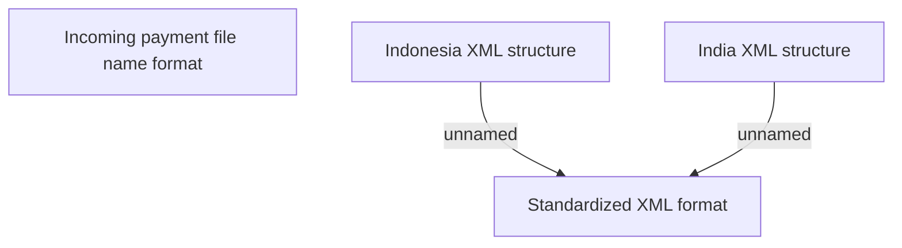

# Import XML files

- **Diagram Type**: Custom
- **Package**: HomerSelect/BSL/Modules/Incoming Payments/Analytical Model/Import incoming payments/Business Rules
- **Diagram ID**: 143099
- **Elements**: 4
- **Connectors**: 2

