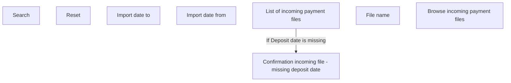

# Browse incoming payment file

- **Diagram Type**: Custom
- **Package**: HomerSelect/BSL/Modules/Incoming Payments/Analytical Model/Import incoming payments/User Interface
- **Diagram ID**: 143106
- **Elements**: 8
- **Connectors**: 1

