# Access Rights

- **Diagram Type**: Custom
- **Package**: HomerSelect/BSL/Modules/Incoming Payments/Analytical Model/Management of incoming payments/Access Rights
- **Diagram ID**: 164243
- **Elements**: 32
- **Connectors**: 6

```mermaid
graph TD
    n_05_553_Refund_overpayment["05.553 Refund overpayment"]
    n_05_553_Refund_overpayment["05.553 Refund overpayment"]
    n_05_552_Transfer_overpayment["05.552 Transfer overpayment"]
    n_05_552_Transfer_overpayment["05.552 Transfer overpayment"]
    n_05_551_Manage_overpayment["05.551 Manage overpayment"]
    n_05_551_Manage_overpayment["05.551 Manage overpayment"]
    External_Reference["External Reference"]
    n_05_361_Create_incoming_payment_on_external_request["05.361 Create incoming payment on external request"]
    n_05_360_Cancel_incoming_payment_on_external_request["05.360 Cancel incoming payment on external request"]
    n_05_361_Create_incoming_payment_on_external_request["05.361 Create incoming payment on external request"]
    n_05_360_Cancel_incoming_payment_on_external_request["05.360 Cancel incoming payment on external request"]
    n_05_020_Browse_incoming_payments_CUSTOM["05.020 Browse incoming payments CUSTOM"]
    n_05_020_Browse_incoming_payments_PAYMENT_TYPE["05.020 Browse incoming payments PAYMENT TYPE"]
    n_05_020_Browse_incoming_payments_FROM_CLIENTS["05.020 Browse incoming payments FROM CLIENTS"]
    n_05_020_Browse_incoming_payments_CONTRACT["05.020 Browse incoming payments CONTRACT"]
    n_05_020_Browse_incoming_payments_STANDARD["05.020 Browse incoming payments STANDARD"]
    n_05_380_Create_incoming_payment_on_local_request["05.380 Create incoming payment on local request"]
    MOD_05_380_Create_incoming_payment_on_local_request["{MOD}05.380 Create incoming payment on local request"]
    MOD_05_345_Cancel_incoming_payment_on_local_request["{MOD}05.345 Cancel incoming payment on local request"]
    n_05_345_Cancel_incoming_payment_on_local_request["05.345 Cancel incoming payment on local request"]
    n_05_045_Cancel_incoming_payment["05.045 Cancel incoming payment"]
    n_05_040_Cancel_incoming_payment_manually["05.040 Cancel incoming payment manually"]
    n_05_070_Divide_incoming_payment["05.070 Divide incoming payment"]
    n_05_080_Create_incoming_payment_manually["05.080 Create incoming payment manually"]
    n_05_050_Show_incoming_payment_detail["05.050 Show incoming payment detail"]
    n_05_020_Browse_incoming_payments["05.020 Browse incoming payments"]
    n_05_045_Cancel_incoming_payment["05.045 Cancel incoming payment"]
    n_05_040_Cancel_incoming_payment_manually["05.040 Cancel incoming payment manually"]
    n_05_070_Divide_incoming_payment["05.070 Divide incoming payment"]
    n_05_080_Create_incoming_payment_manually["05.080 Create incoming payment manually"]
    n_05_050_Show_incoming_payment_detail["05.050 Show incoming payment detail"]
    n_05_020_Browse_incoming_payments["05.020 Browse incoming payments"]
    n_05_361_Create_incoming_payment_on_external_request -->|unnamed| n_05_361_Create_incoming_payment_on_external_request
    n_05_360_Cancel_incoming_payment_on_external_request -->|unnamed| n_05_360_Cancel_incoming_payment_on_external_request
    MOD_05_380_Create_incoming_payment_on_local_request -->|unnamed| n_05_380_Create_incoming_payment_on_local_request
    MOD_05_345_Cancel_incoming_payment_on_local_request -->|unnamed| n_05_045_Cancel_incoming_payment
    n_05_360_Cancel_incoming_payment_on_external_request -->|unnamed| n_05_045_Cancel_incoming_payment
    MOD_05_345_Cancel_incoming_payment_on_local_request -->|unnamed| n_05_345_Cancel_incoming_payment_on_local_request
```

