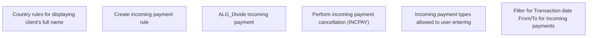

# Business Rules

- **Diagram Type**: Custom
- **Package**: HomerSelect/BSL/Modules/Incoming Payments/Analytical Model/Management of incoming payments/Business Rules
- **Diagram ID**: 164244
- **Elements**: 6
- **Connectors**: 0

